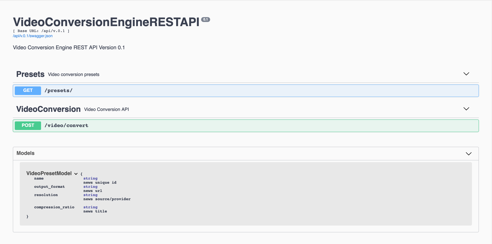
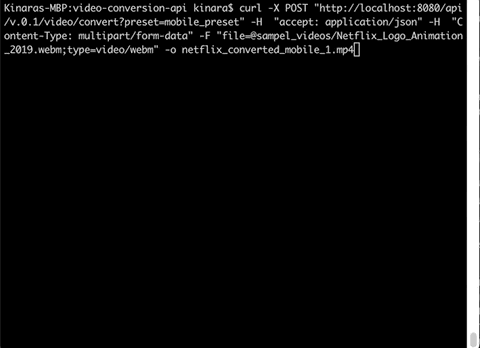

# Accra, Simple Video Conversion API with FFMPEG engine

Here, yet another PoC application for converting a video with several presets or types. the idea is to use [FFMPEG](https://ffmpeg.org/) library 

The API receive a video files and type of preset from users then return the converted video based on selected preset. 

## Project dependency
this project dependent on several libraries and frameworks such as:
- ffmpeg
- flask
- flask restplus
- ffmpy
- gunicorn 

other detailed python packages needed by this project can be seen on requirements.txt

## Clone and Running the project using docker 
to run this project with docker, first you need to clone the repository
```
git clone <repo path>
```

run with docker-compose
```
docker-compose up --build
```

run with docker build 
```
docker build . -t accra_api
docker run -p 8080:8080 accra_api
```

## Api docs with Swagger
We use swagger for documenting the project API, the url for accessing api documentation is [http://localhost:8080/api/v.0.1/doc/](http://localhost:8080/api/v.0.1/doc/), you can also try the API request directly from the swagger



or using curl command 
```
curl -X POST "http://localhost:8080/api/v.0.1/video/convert?preset=mobile_preset" -H  "accept: application/json" -H  "Content-Type: multipart/form-data" -F "file=@sampel_videos/Netflix_Logo_Animation_2019.webm;type=video/webm" -o netflix_converted_mobile_1.mp4
```



## Testing the API 
The simple testing script are available on ```app/tests``` directory, to make it simple we only utilize unittest python module for testing script dependency.

## Online demo
online demo maybe available for this project... 